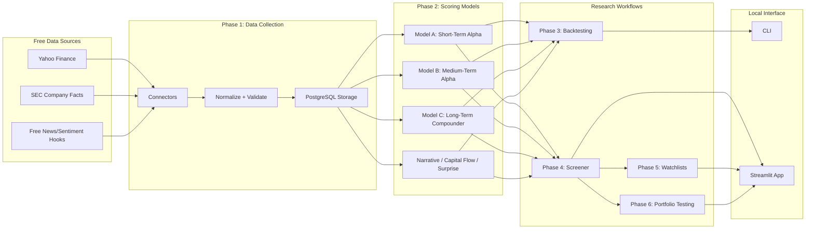

# Architecture

TAE is built as a local-first research engine with a clear split between data collection, scoring, backtesting, screening, and presentation.

## Design Principles

- Free data only in Version 1.
- No brokerage integration.
- No automatic trading.
- Scores are transparent weighted components.
- Backtesting is mandatory before trusting a score.
- Data connectors are isolated so paid or institutional feeds can be added later without rewriting the scoring engine.

## Data Model

Core tables:

- `companies`: ticker, company name, sector, industry, market cap
- `price_bars`: OHLCV history by ticker and date
- `financial_snapshots`: revenue, EPS, margins, cash flow, debt, ROIC, valuation fields
- `score_snapshots`: model scores, risk score, recommendation, and component payloads
- `watchlist_items`: watchlist membership and notes

## Scoring Flow

1. Collect and normalize company, price, volume, and financial data.
2. Build factor inputs for each ticker.
3. Score each weighted component from 0 to its maximum weight.
4. Sum components into model scores out of 100.
5. Add auxiliary narrative, capital flow, and surprise scores.
6. Compute risk score and overall score.
7. Store the snapshot for screeners, watchlists, and backtests.

## Backtesting Flow

For each historical date:

1. Calculate scores using only data available up to that date.
2. Group tickers into score bands.
3. Calculate forward returns for 1 week, 2 weeks, 1 month, 2 months, 4 months, 6 months, and 12 months.
4. Measure average return, win rate, volatility, max drawdown, and Sharpe ratio.
5. Compare portfolio variants against benchmark returns.

